# Dein eigenes Open-Source-Finanztool - Firefly III

Neues Jahr - neue Möglichkeiten!  
Vielleicht kann firefly dir helfen, dein(e) Ziel(e) schneller zu erreichen, indem du einen besseren Überblick über deine Finanzen und deine guten und schlechten Gewohnheiten bekommst. 

Es ist wie üblich Open Source und deckt auch den Datenschutzteil ab.  
Du solltest eine [Cloud](https://techsaviours.org/news/user/pages/01.blog/your-own-open-source-finance-tool-firefly-iii/there_is_no_cloud.jpg) überhaupt nicht benutzen, wenn es nicht deine eigene ist, und besonders wenn es um deine Finanzen geht. Es hat also auch die Privatsphäre im Blick.... ein Zitat des Entwicklers:

> It is completely self-hosted and isolated, and will never contact external servers until you explicitly tell it to.

Uebersetzt:  
> Es wird vollständig selbst gehostet und isoliert und nimmt erst dann Kontakt zu externen Servern auf, wenn Sie es ausdrücklich wünschen.

Es gibt noch viele andere, aber dieses ist ein einfaches System für deine gesamte Finanzverwaltung. Gnucash, zum Beispiel, ist ein weiteres sehr hilfreiches Tool für Ihre Buchhaltung - geschäftlich und privat. Aber wenn du alles zusammen haben möchtest, privat (dein Bankkonto, das Bankkonto deines Partners, Sparkonten, Kredite, Visa-Lastschriften,...), Unternehmen 1, Unternehmen 2.... So hast du den ultimativen Überblick über alle deine Finanzen in nur einer Software. 

> - You can create and edit transactions, accounts, and give them budgets, categories and tags.
> - You can automate part of this with recurring transactions and auto-budgets.
> - You can keep track of liabilities.
> - You can import data into Firefly III from almost any bank.

Uebersetzt:  
> - Sie können Transaktionen und Konten erstellen und bearbeiten und ihnen Budgets, Kategorien und Tags zuweisen.
> - Sie können einen Teil davon mit wiederkehrenden Transaktionen und automatischen Budgets automatisieren.
> - Sie können die Verbindlichkeiten verfolgen.
> - Sie können Daten von fast jeder Bank in Firefly III importieren.

# Features

Siehe einfach den Link https://docs.firefly-iii.org/firefly-iii/about-firefly-iii/introduction/?mtm_campaign=docu-internal&mtm_kwd=introduction. Es ist nicht notwendig, sie hier ebenfalls aufzuführen. Aber eine Sache ist gut zu erwähnen:

> Supports any currency you want, including crypto currencies such as ₿itcoin and Ξthereum

Uebersetzt:  
> Unterstützt jede gewünschte Währung, einschließlich Kryptowährungen wie ₿itcoin und Ξthereum.

Wenn du also ein Krypto-Typ bist und/oder Geld in anderen Ländern hast, ist auch dies möglich.


# Installation

Wir werden hier eine schnelle [Docker-Installation](https://docs.firefly-iii.org/firefly-iii/installation/docker/) verwenden. Nur um zu zeigen, was Firefly III leisten kann. Sieh dir die anderen Optionen an, wenn du einen anderen Weg bevorzugst und übernimm bitte die Verantwortung für deine eigene Sicherheit.  
Wir haben auch einen Installationstutorial basierend auf Arch in [unserem Wiki](https://wiki.techsaviours.org/en/extras/firefly3), wenn du es vorziehst, Docker nicht zu benutzen.


## Docker & docker compose

```
pacman -Sy docker docker-compose --noconfirm
systemctl enable --now docker.service
```


## docker-compose.yml
```
mkdir /opt/firefly3
cd /opt/firefly3
wget https://raw.githubusercontent.com/firefly-iii/docker/main/docker-compose.yml
```

> **NOTE**:  
> Ändere `docker-compose.yml` nach deinen Bedürfnissen - `ports`, `password`


## .env
```
wget https://raw.githubusercontent.com/firefly-iii/firefly-iii/main/.env.example -O .env
```

Ändere zumindest:
```
TRUSTED_PROXIES=**
APP_URL=http://SERVER_IP:PORT
```


### Beispiel docker-compose Datei
```
version: '3.3'

services:
  app:
    image: fireflyiii/core:latest
    restart: always
    volumes:
      - firefly_iii_upload:/var/www/html/storage/upload
    env_file: .env
    ports:
      - 80:8080
    depends_on:
      - db
  db:
    image: mariadb    
    hostname: fireflyiiidb
    restart: always
    environment:
      - MYSQL_RANDOM_ROOT_PASSWORD=yes
      - MYSQL_USER=firefly
      - MYSQL_PASSWORD=secret_firefly_password
      - MYSQL_DATABASE=firefly
    volumes:
      - firefly_iii_db:/var/lib/mysql
volumes:
  firefly_iii_upload:
  firefly_iii_db:
```


## Download & start
```
docker compose up -d
```


# Firefly III

Go to `http://SERVER_IP:PORT`.

> **HINT**:  
> `Unable to connect`, einfach noch ein bisschen warten.

https://firefly-iii.org  
https://docs.firefly-iii.org/


## Neues Konto registrieren

Ganz einfach... 
[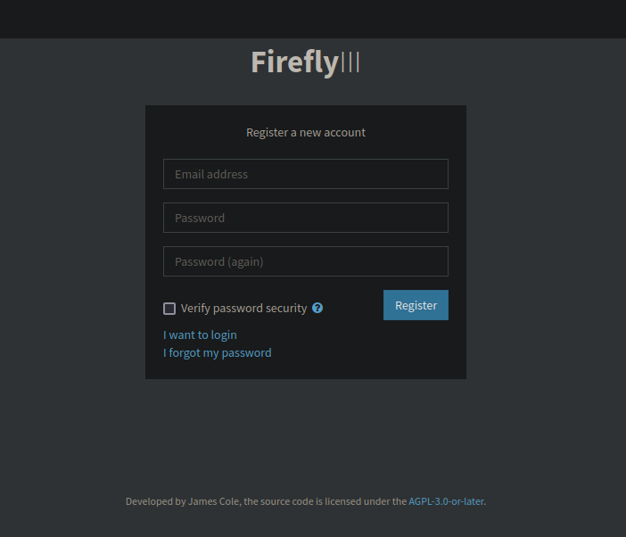](https://techsaviours.org/news/user/pages/01.blog/your-own-open-source-finance-tool-firefly-iii/registration.png)


## Die ersten Schritte

[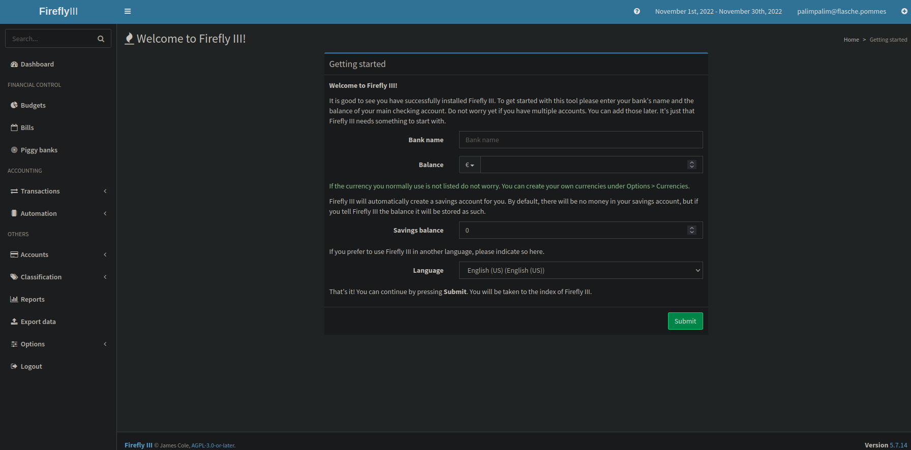](https://techsaviours.org/news/user/pages/01.blog/your-own-open-source-finance-tool-firefly-iii/getting_started.png)

1. Lies zuerst die Seite ;) 
2. Beginn mit Ihrer Privatbank (Bankname - Ihr Name)
	- Wenn du nur deine eigene Bank hast, kannst du nur den Banknamen verwenden. Wenn du die Bank deines Partners und ggf. deine Firma usw. hinzufügst, ist es einfacher, einen Überblick über deinen Namen zu erhalten. Vor allem, wenn es die gleiche Bank ist. Du kannst den Namen natürlich auch später noch ändern.
3. `Submit` wenn du bereit bist und die intro gelesen hast.


## Navigation
[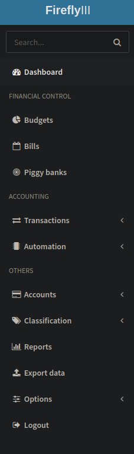](https://techsaviours.org/news/user/pages/01.blog/your-own-open-source-finance-tool-firefly-iii/navigation.png)


### Dashboard
[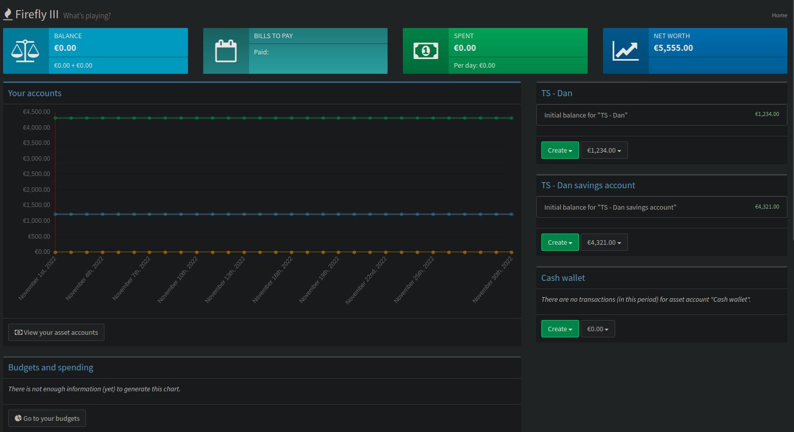](https://techsaviours.org/news/user/pages/01.blog/your-own-open-source-finance-tool-firefly-iii/dashboard.png)


### Budgets

[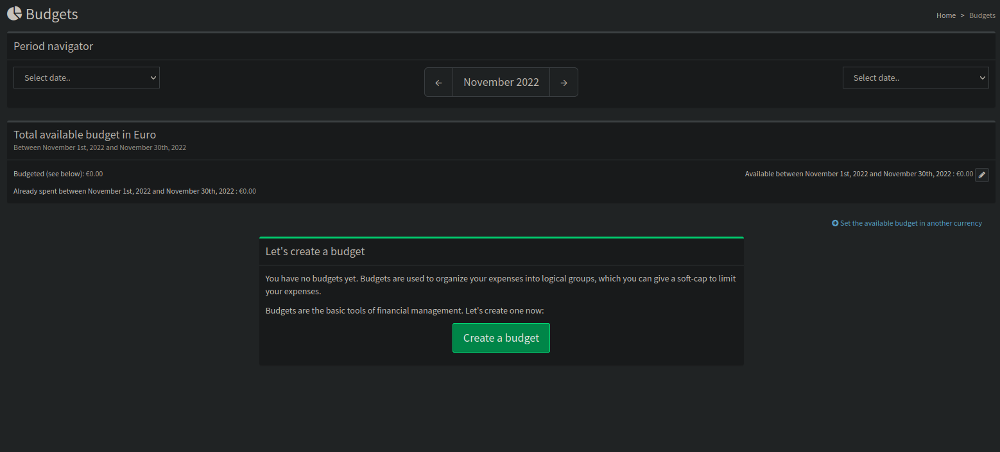](https://techsaviours.org/news/user/pages/01.blog/your-own-open-source-finance-tool-firefly-iii/budget.png)

Eines der meistgenutzten Budgets ist wahrscheinlich das für *Lebensmittel*. Setze dir ein Limit für dein wöchentliches/monatliches Lebensmittelbudget. 

[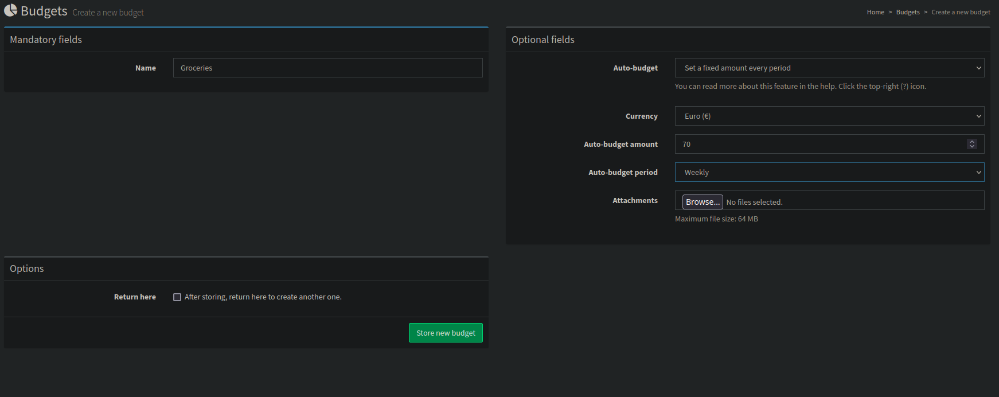](https://techsaviours.org/news/user/pages/01.blog/your-own-open-source-finance-tool-firefly-iii/budget2.png)

Die Frage, die sich hier stellt, ist, welches `Auto-Budget` du wählen musst.

1. `Set a fixed amount every period`
	 
	 Es ist eigentlich ganz einfach. Jede Woche bekommst du den gleichen Betrag. Jede Woche "Starting new".

2. `Add an amount every period`

	So hast du die Möglichkeit, in der nächsten Woche mehr zu kaufen, wenn du in der Woche davor gespart hast. Das nicht ausgegebene Geld der letzten Woche wird einfach zum Limit der nächsten Woche addiert. Das kann dir zeigen, wie viel Geld du erhöhen (sparen) kannst. Gleichzeitig wirst du wahrscheinlich am Ende mehr Geld ausgeben als der festgelegte Betrag. Es hängt ein wenig davon ab, wie diszipliniert du bist. Bist du eher ein Mensch wie:
	
        - Wahnsinn! Ich habe letzte Woche so viel Geld gespart, mal sehen, wie viel Geld ich diese Woche sparen kann. LASS ES MEHR WERDEN! 
        - Wahnsinn! Ich habe letzte Woche so viel Geld gespart! Diese Woche werde ich alles ausgeben!

Die Verwendung fester Beträge ist wahrscheinlich der beste Weg, um Geld zu sparen, wenn das dein Ziel ist.

https://docs.firefly-iii.org/firefly-iii/concepts/budgets/  


### Bills

[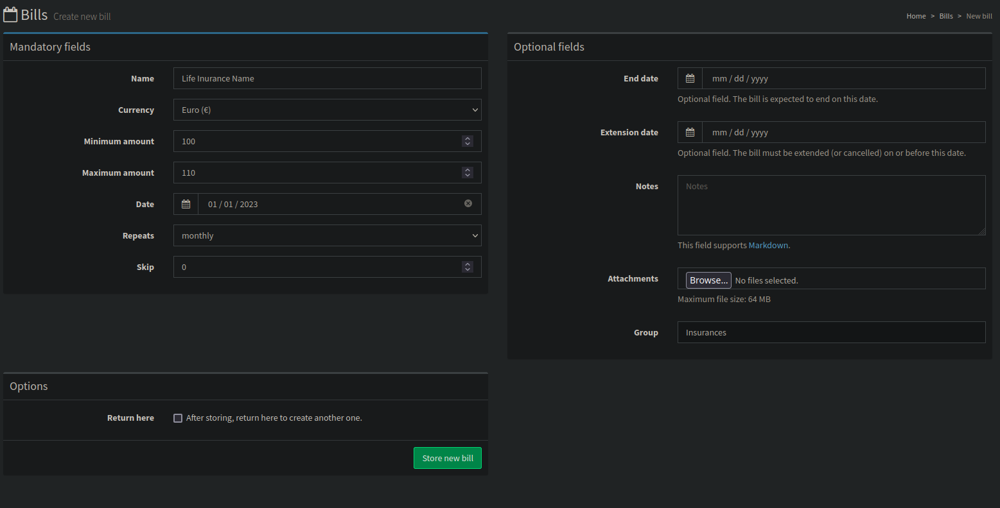](https://techsaviours.org/news/user/pages/01.blog/your-own-open-source-finance-tool-firefly-iii/bills.png)

Füge hier einfach alle Fixkosten wie Hypothek, Miete, ..... hinzu.

Die *minimum and maximum* hängt davon ab, wofür du es brauchst. Der Strom variiert zum Beispiel zwischen diesem und jenem Betrag. Wenn deine Miete immer gleich hoch ist, fügst du einfach den gleichen Betrag für beide hinzu.

Es ist wichtig, dass du das richtige Datum für die nächste Rechnung angibst. Wenn du vierzehntägig Miete zahlst, musst du 1 Woche auf *Skip* setzen.

> If you enter a number in the "skip" field, the bill will be automatically skipped every X times; a bill that arrives every 3 months can be entered by filling in "2".

Uebersetzt:
> Wenn du eine Zahl in das Feld "überspringen" einträgst, wird die Rechnung automatisch alle X-mal übersprungen; eine Rechnung, die alle 3 Monate eintrifft, kann durch Eingabe von "2" eingegeben werden.

Füge auch eine *Group* hinzu, die dir später einen besseren Überblick geben wird. Der Rest ist im Grunde selbsterklärend.

> *NOTE:*  
> Wundere dich nicht, wenn du zu *Automation* - *Rules* weitergeleitet wirst. Gehe zu [Automation - Rules](#rules) (hier im Tutorial), wenn du mit deiner Einrichtung fortfahren willst. Ich werde mit dem Aufbau der Navigation/Firefly3 fortfahren.

https://docs.firefly-iii.org/firefly-iii/advanced-concepts/bills/


### Piggy banks

[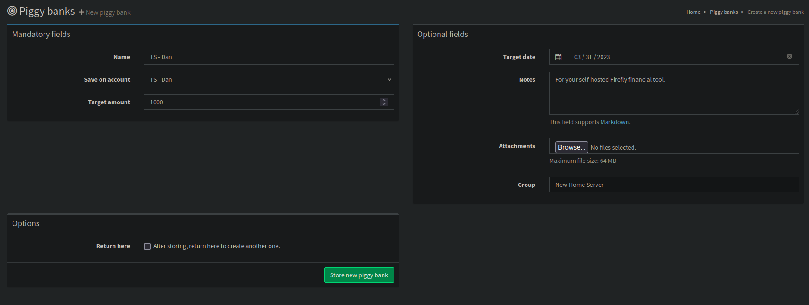](https://techsaviours.org/news/user/pages/01.blog/your-own-open-source-finance-tool-firefly-iii/piggy_bank.png)

Eigentlich ist alles so gut wie selbsterklärend, das einzige "Problem", auf das du stoßen wirst, ist, wie du dein Ziel erreichen willst. Wenn du ein großes Ziel hast, musst du vielleicht zwei oder sogar vier Bankkonten zu einem Ziel ("Group") hinzufügen. Mehrere Konten in einer "Group" zu haben, kann etwas verwirrend sein, weil du nicht weißt, welches Bankkonto welches ist, wenn du es als dein eigentliches Ziel "Name" nennst. Ich verwende gerne den Namen meines Bankkontos, wenn ich mehrere Konten zu einer "Group" hinzufügen möchte. Sieh dir das Bild unten an.

[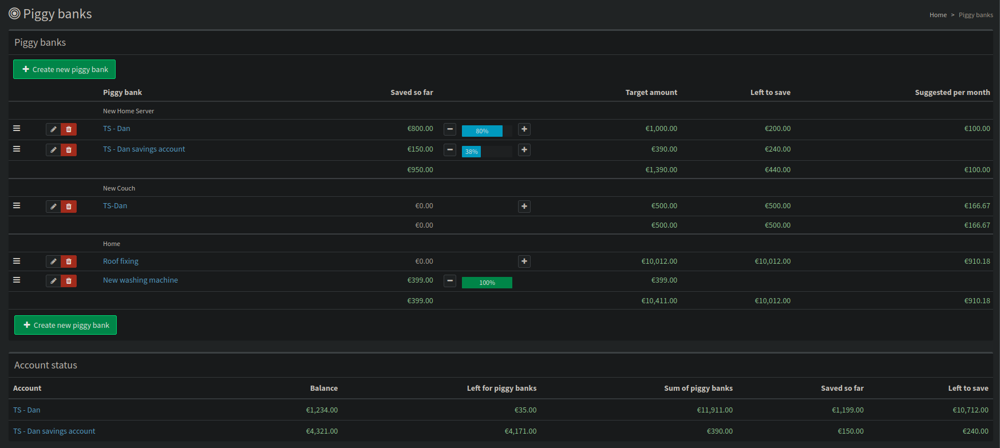](https://techsaviours.org/news/user/pages/01.blog/your-own-open-source-finance-tool-firefly-iii/piggy_bank2-1.png)

Es sind also noch 35 Euro (unter "Account status") auf meinem Hauptkonto, die ich für die Dachreparatur verwenden möchte, aber ist es das Hauptkonto?

https://docs.firefly-iii.org/firefly-iii/advanced-concepts/piggies/


### Transactions

Dies braucht nicht erklärt zu werden. Du findest dort alle deine Transaktionen (expenses, revenue/income, transfers).


### Automation

#### Rules

Jetzt wird es ein bisschen komplizierter, weil hier viele Dinge gleichzeitig passieren. Wir werden hier mehr oder weniger nur die Grundlagen behandeln.

[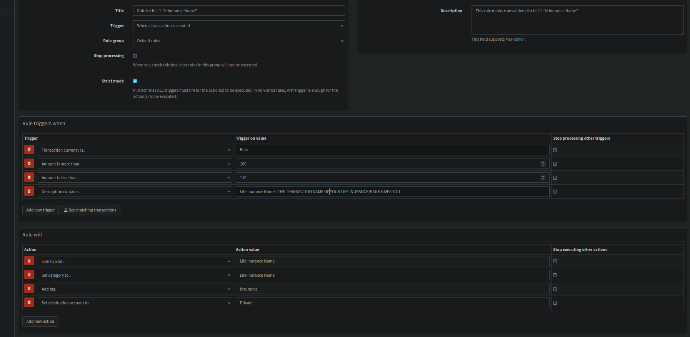](https://techsaviours.org/news/user/pages/01.blog/your-own-open-source-finance-tool-firefly-iii/creating_a_rule.png)

Du kannst eine `Rule group` direkt unter `Rules` erstellen. Du kannst sie in einem anderen Tab deines Browsers öffnen, um sie zu erstellen. Eine Regelgruppe könnten deine Hauptkonten sein (`Personal`, `Firma1`, `Firma2`).

Die Option `Description contains` in `Trigger` ist hier eine der wichtigsten Optionen. Lade eine `csv`-Datei von deiner Bank herunter und prüfe die Namen deiner Transaktionen. Wir werden die `csv`-Datei später mit dem Datenimporter von Firefly importieren. Der Rest in `Trigger` ist so ziemlich selbsterklärend. Es gibt auch eine Menge anderer Dinge, die Ihnen vielleicht besser passen.

Der Teil `Action` enthält wichtigere Dinge, die auch vorher angelegt werden müssen wie `Rule group`, aber irgendwo muss man ja anfangen und ich mache einfach weiter.  
Die Funktion `Set category to..` gibt dir einen guten Überblick über alle deine Kategorien in deinem Bankkonto während des angegebenen Zeitraums. Und hier musst du dir überlegen, wie du es haben willst.  
Ein gutes Beispiel dafür ist `Versicherungen`. Bist du mit einer Kategorie zufrieden, die nur Versicherungen enthält, oder möchtest du alle deine Versicherungen in der Tabelle sehen? Dann musst du für jede Versicherung eine eigene Kategorie anlegen.  

Ein anderes Beispiel wären Lieferanten, eine Kategorie für alle Lieferanten oder willst du wissen, welche Lieferanten das meiste Geld von dir bekommen?

Die Funktion `Add tag` kann sehr hilfreich sein, wenn du eine Kategorie als Lieferant einstellst, aber sehen willst, wie viel du für einen bestimmten Lieferanten bezahlt hast. Oder wenn du alle Versicherungen in jeder Kategorie separat hast. Und ein Tag, das alle "Versicherungen" abdeckt.  
Diese Kategorie kann als Unterkategorie gesehen werden, ohne dass du eine Tabelle in deinem Bankkonto sehen wirst.


`Set destination account to..` ...  
Hängt davon ab, wie viele `Expense accounts` du hinzufügen willst, z.B. `Personal`, `Firma1`, `Firma2`, ...  
Ich schlage vor, es einfach zu halten. Wenn du viele Ausgabenkonten einrichtest, wirst du den Überblick verlieren. Dasselbe gilt für zu viele Kategorien und zu viele Tags. Nehmen wir an, du hast 4 persönliche Konten: 2 für dich (Hauptkonto und Sparkonto) und das gleiche für deinen Partner. Alle Transaktionen auf all Ihren persönlichen Konten sind eigentlich nur eine `Personal` Ausgabe.

Wie ich bereits erwähnt habe, besteht der Hauptgrund für die Erstellung von Regeln darin, die Transaktion beim Importieren der CSV-Datei automatisch dem richtigen Bankkonto, der richtigen Kategorie und den richtigen Tags zuzuordnen. Andernfalls verliert man sehr schnell den Überblick, wenn man alles manuell hinzufügt, und man kommt mit den Tags durcheinander, weil man einfach vergisst, wie der Name des Tags lautete, ebenso bei zu vielen Kategorien. Diese Schritte sind wirklich wichtig. Überlege dir genau, wie deine Struktur aussehen soll. Andernfalls wirst du es nicht lange nutzen wollen, weil es dich zu viel Zeit kostet und dir keinen Spaß macht.

Siehe auch dazu [categories](https://docs.firefly-iii.org/firefly-iii/concepts/categories/) und [tags](https://docs.firefly-iii.org/firefly-iii/concepts/tags/).


#### Recurring transactions 

Ich persönlich verwende dies nicht, weil ich es vorziehe, alle meine Transaktionen zu importieren. Und ich bin kein Fan davon, Zahlungen zu automatisieren. Das Gleiche gilt für die Einrichtung bei einem echten Bankkontos. Diese Zahlungen werden zu schnell in Vergessenheit geraten.

https://docs.firefly-iii.org/firefly-iii/advanced-concepts/recurring/


### Accounts


#### Asset accounts

Du solltest jetzt auch mindestens 3 Konten haben:
1. BankName - IhrName
2. BankName - IhrName Sparkonto
3. Cash wallet

Hier kannst du weitere Konten ändern und hinzufügen.

[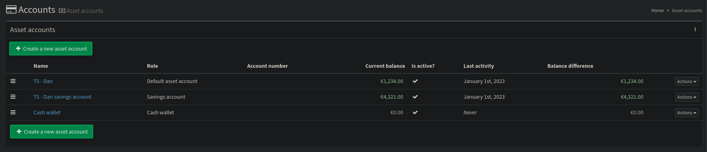](https://techsaviours.org/news/user/pages/01.blog/your-own-open-source-finance-tool-firefly-iii/asset_accounts.png)

https://docs.firefly-iii.org/firefly-iii/concepts/accounts/#default-asset-accounts


#### Expense accounts

[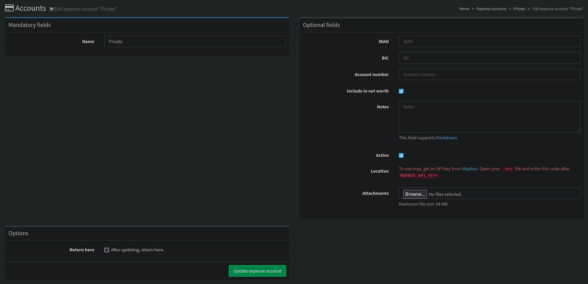](https://techsaviours.org/news/user/pages/01.blog/your-own-open-source-finance-tool-firefly-iii/expenses.png)

Ich ziehe es vor, es hier einfach zu halten. Ich arbeite mehr mit Kategorien und Tags. Es bleibt dir überlassen, ob du alle Ausgaben bereits hier oder unter Kategorien hinzufügen möchtest. Ich verwende zum Beispiel nur privat und habe "grocery shops" als Kategorie und wenn ich wissen will, wie viel ich für einen bestimmten Laden ausgebe, habe ich den Namen des Ladens als Tag. Du kannst es aber auch so machen:

[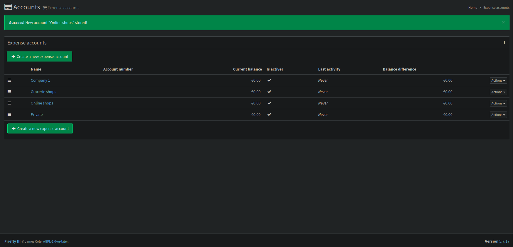](https://techsaviours.org/news/user/pages/01.blog/your-own-open-source-finance-tool-firefly-iii/expenses2.png)

Vielleicht brauchst du eine "Expense" bereits als "Grocery shops" und das spezifische Geschäft als Kategorie und verschiedene Tags für alles, was du in diesem Geschäft gekauft hast. Auf diese Weise könntest du nachvollziehen, wie viel Geld du fuer Milch letztes Jahr bezahlt hast.


https://docs.firefly-iii.org/firefly-iii/concepts/accounts/#expense-accounts


#### Revenue accounts 

[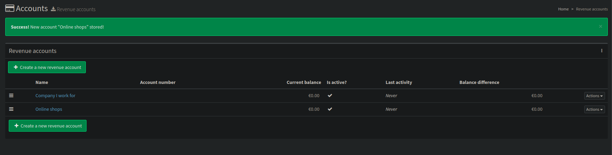](https://techsaviours.org/news/user/pages/01.blog/your-own-open-source-finance-tool-firefly-iii/revenue.png)

Eigentlich ähnlich wie Ausgaben. Du kannst sie auch privat nutzen oder wenn du eine Rückerstattung von einem Online-Shop bekommst. 


####  Liabilities

[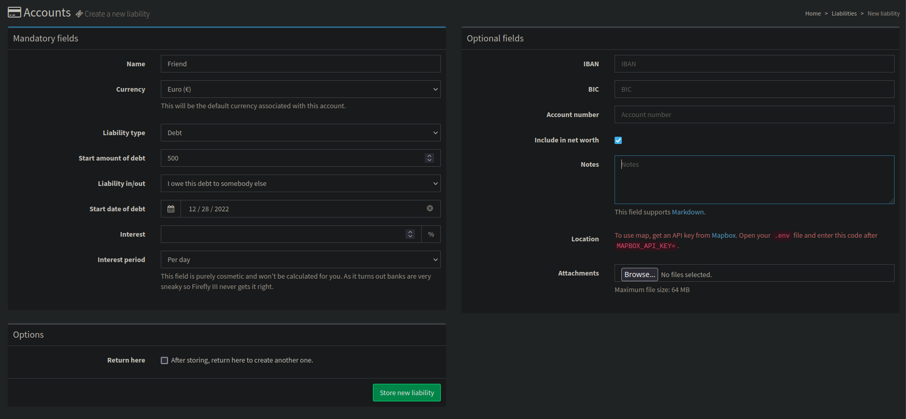](https://techsaviours.org/news/user/pages/01.blog/your-own-open-source-finance-tool-firefly-iii/liabilities.png)

Eine weitere gute Funktion, wenn du jemandem Geld geliehen hast oder wenn du Darlehen, Schulden oder Hypotheken zu zahlen hast. Hier hast du die Möglichkeit, auch diese zu verwalten.

https://docs.firefly-iii.org/firefly-iii/concepts/accounts/#liabilities


### Classification (Categories, Tags & Groups)

Wie bereits unter [Rules](#rules) erläutert, werde ich hier nicht weiter ins Detail gehen.

https://docs.firefly-iii.org/firefly-iii/concepts/categories/  
https://docs.firefly-iii.org/firefly-iii/concepts/tags/  
https://docs.firefly-iii.org/firefly-iii/concepts/groups/


### Reports

[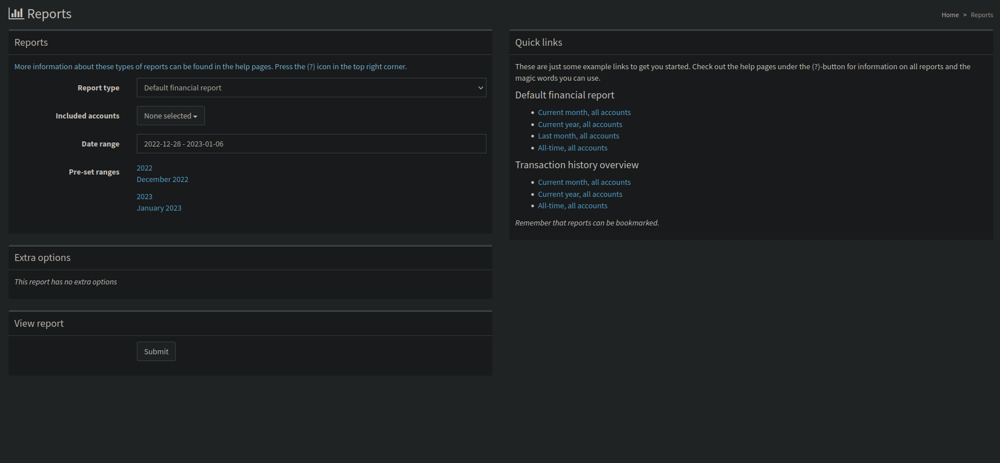](https://techsaviours.org/news/user/pages/01.blog/your-own-open-source-finance-tool-firefly-iii/reports.png)

Eine Übersicht darüber, was deine Konten gemacht haben. Du kannst alle Konten oder nur bestimmte Konten auswählen. Das Gleiche gilt für Kategorien und Tags.
Du kannst einige Diagramme und andere Informationen über deine Konten einsehen.

https://docs.firefly-iii.org/firefly-iii/advanced-concepts/reports/


### Export data

[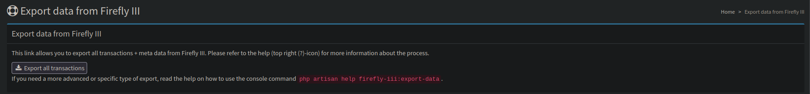](https://techsaviours.org/news/user/pages/01.blog/your-own-open-source-finance-tool-firefly-iii/export_data.png)

Ich habe es nie benutzt. Also kein Kommentar hier. Schau dir einfach den Link unten an.

https://docs.firefly-iii.org/firefly-iii/exporting-data/


### Options

Hier gibt es eigentlich nichts zu erwähnen. Ich werde einfach einige Screenshots unten lassen. 


#### Profile

[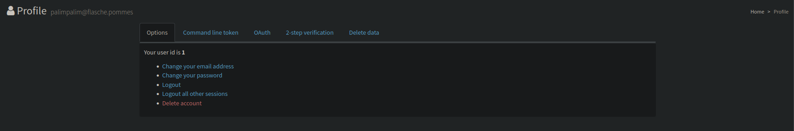](https://techsaviours.org/news/user/pages/01.blog/your-own-open-source-finance-tool-firefly-iii/profile.png)


#### Preferences

[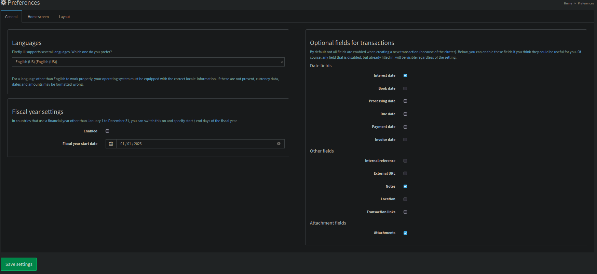](https://techsaviours.org/news/user/pages/01.blog/your-own-open-source-finance-tool-firefly-iii/preferences.png)  
[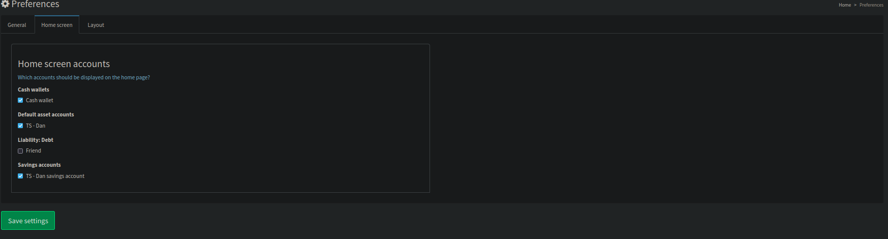](https://techsaviours.org/news/user/pages/01.blog/your-own-open-source-finance-tool-firefly-iii/preferences2.png)  
[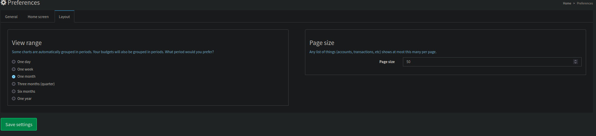](https://techsaviours.org/news/user/pages/01.blog/your-own-open-source-finance-tool-firefly-iii/preferences3.png)  


#### Currencies

[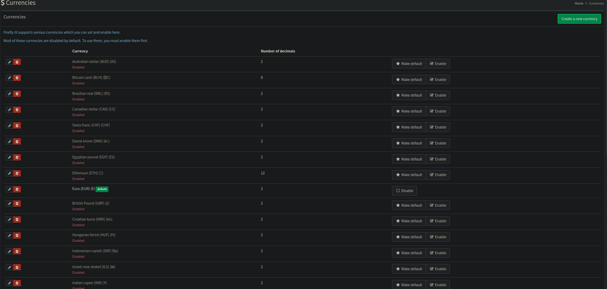](https://techsaviours.org/news/user/pages/01.blog/your-own-open-source-finance-tool-firefly-iii/currencies.png)  


#### Administration

[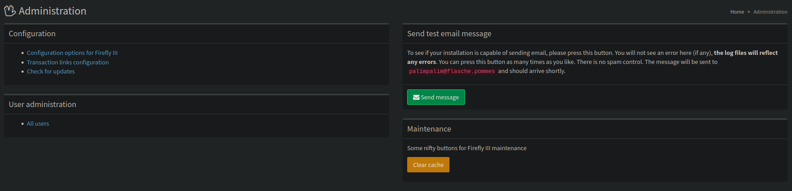](https://techsaviours.org/news/user/pages/01.blog/your-own-open-source-finance-tool-firefly-iii/administration.png)  
[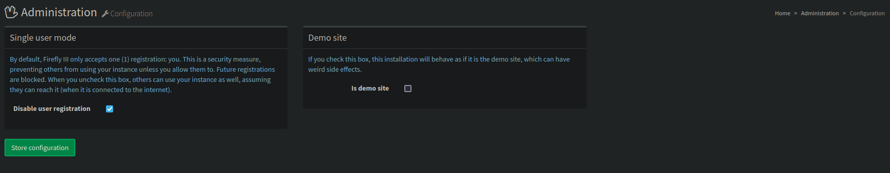](https://techsaviours.org/news/user/pages/01.blog/your-own-open-source-finance-tool-firefly-iii/administration2.png)  
[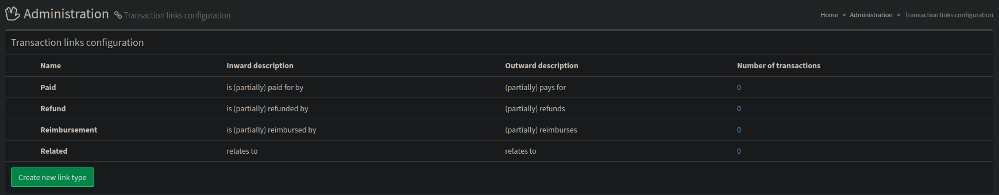](https://techsaviours.org/news/user/pages/01.blog/your-own-open-source-finance-tool-firefly-iii/administration3.png)  
[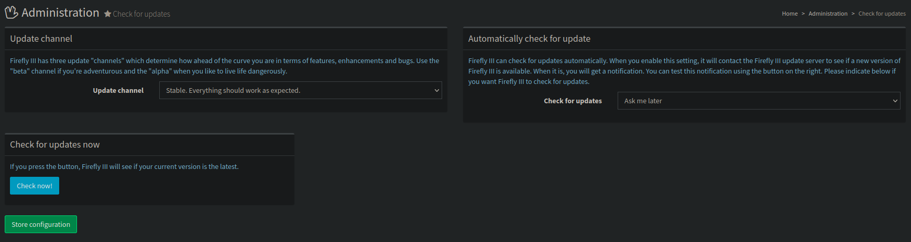](https://techsaviours.org/news/user/pages/01.blog/your-own-open-source-finance-tool-firefly-iii/administration4.png)  
[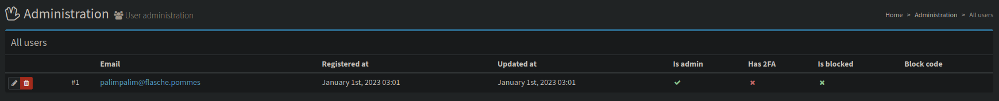](https://techsaviours.org/news/user/pages/01.blog/your-own-open-source-finance-tool-firefly-iii/administration5.png)  


# Data importer

Ein einfacher Weg, um alle deine Transaktionen via csv-Dateien zu importieren.

https://docs.firefly-iii.org/data-importer/


## docker-compose.yml

Füge folgendes zu der [docker-compose.yml](#example-docker-compose-fi) Datei hinzu:
```
  fidi:
    image: fireflyiii/data-importer:latest
    restart: always
    env_file: .fidi.env
    ports:
      - 8081:8080
    depends_on:
      - app
```

Kurz davor:
```
volumes  :
  firefly_iii_upload:
  firefly_iii_db:
```


## Create access token

Gehe zu deinem http://SERVER_IP:PORT(firefly3)/profile und erstelle ein neues Access Token und nenne es `Importer` oder wie immer du willst.

[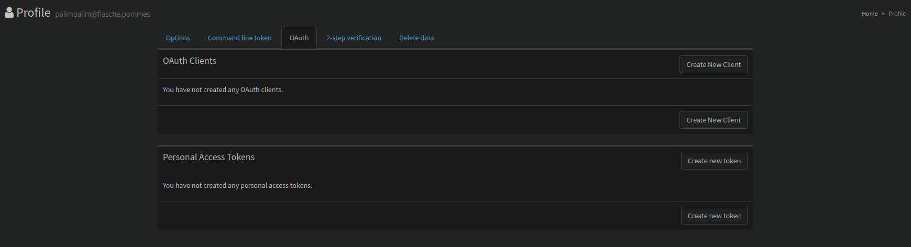](https://techsaviours.org/news/user/pages/01.blog/your-own-open-source-finance-tool-firefly-iii/token.png)  


## .fidi.env
```
wget https://raw.githubusercontent.com/firefly-iii/data-importer/main/.env.example -O .fidi.env
```

Der Link zur Firefly-Hauptseite wird wichtig sein. Was immer du also in [.env](#.env) festgelegt hast (`APP_URL=`), muss auch hier festgelegt werden:

```
FIREFLY_III_URL=http://app:8080
VANITY_URL=http://SERVER_IP:PORT(firefly3)
FIREFLY_III_ACCESS_TOKEN=YourTOKEN
TRUSTED_PROXIES=**
APP_URL=http://SERVER_IP:PORT(data-importer)
```


## Download & start
```
docker compose up -d
```

Gehe zu http://SERVER_IP:PORT(data-importer). 

[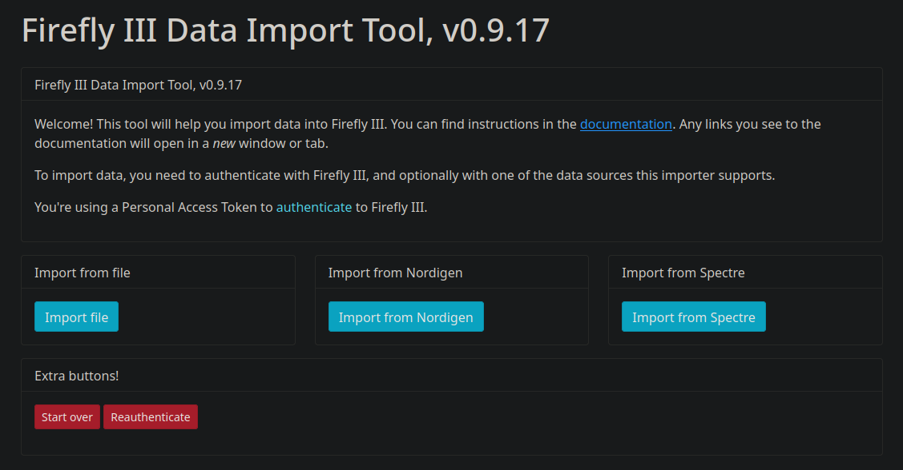](https://techsaviours.org/news/user/pages/01.blog/your-own-open-source-finance-tool-firefly-iii/data_importer.png)


## Import file

Geh zu deinem Bank Account und exportiere deine Transaktionen in eine csv-Datei. 

[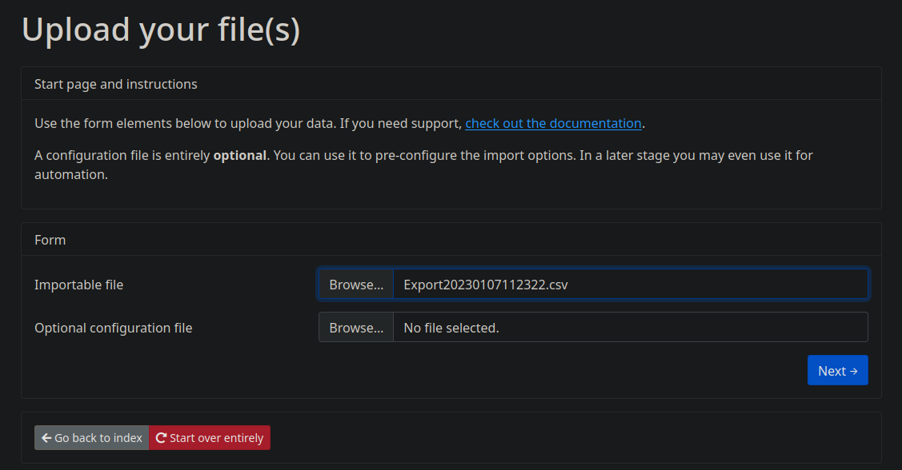](https://techsaviours.org/news/user/pages/01.blog/your-own-open-source-finance-tool-firefly-iii/data_importer2.png)

Du kannst später eine Konfigurationsdatei erstellen, damit du die folgenden Informationen nicht ständig neu eingeben musst.

[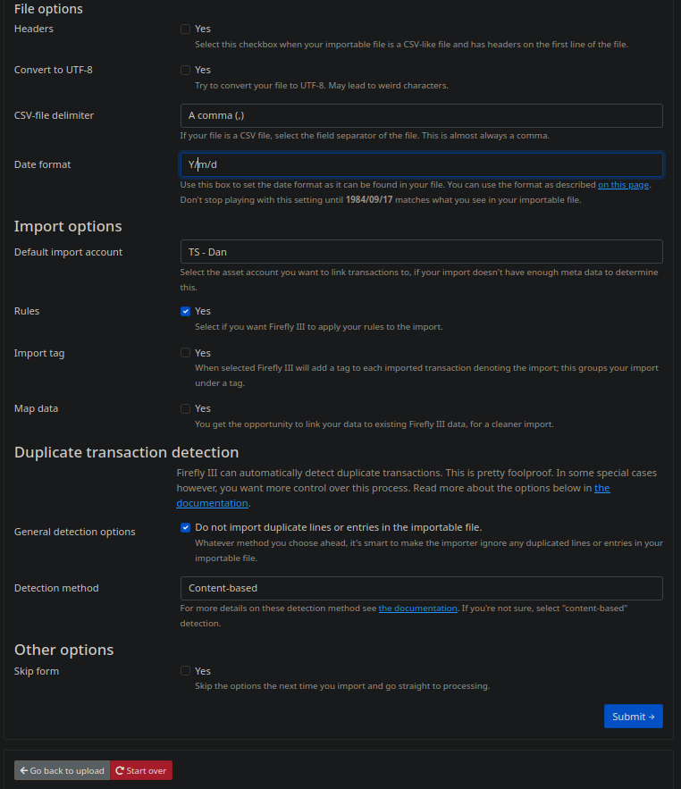](https://techsaviours.org/news/user/pages/01.blog/your-own-open-source-finance-tool-firefly-iii/data_importer3.png)

Ich verwende hauptsächlich die Standardeinstellungen. Nur "Import tag" und "Date format" sind anders. Aber die Einstellungen hängen wirklich davon ab, wie deine Bank deine Transaktionen exportiert. Das musst du selbst ein bisschen testen. Jede Bank ist anders, so dass es keinen Sinn macht, hier eine vernünftige Konfiguration für alle anzugeben. Schau dir dazu den Link https://docs.firefly-iii.org/data-importer/usage/configure/#file-options an, während du es für dich selbst einrichtest.

Nach dem Import siehst du alle Transaktionen unter dem ausgewählten Bankkonto - http://SERVER_IP:PORT(firefly3). Beginne mit der Erstellung deiner [rules](#rules), wenn du denkst, dass sie häufig erscheinen werden.


# Das war's!

Ich hoffe, es hilft dir ein wenig, dieses Jahr mehr Geld zu sparen/zu verdienen, während die Preise weiter in die Höhe schießen.  
Und wenn es dir gefällt, hinterlasse dem Entwickler auch deine persönliche Transaktion in seiner Instanz da - https://www.patreon.com/jc5 und/oder https://github.com/sponsors/JC5. 

Ich wünsche ein gutes Jahr  
Dan